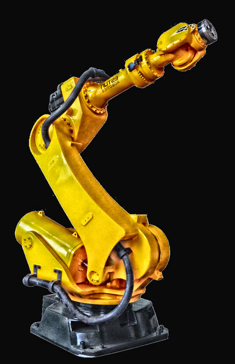

# CLAHE (Contrast Limited Adaptive Histogram Equalization)

This procedural Python script filters input images using CLAHE algorithm according to specified parameters.

## Showcase

### Example

| Input | Light | Default | Strong |
|:-----:|:-----:|:-------:|:------:|
|  |  |  |  |
|  | `-c 0.05 -t 8 8` | `-c 2.0 -t 8 8` | `-c 6.0 -t 32 32` |

## Roadmap

Currently there is no further development planned.

However, should this change, a potential roadmap would look like this:

Version 1.0.1:

1. Rewrite the procedural routine into classes
2. Modularize depending on functionality
3. Refactor and optimize specific routines
4. Documentation via Doxygen

## Dependencies

* Python 2.7
  - OpenCV (`cv2`)
  - NumPy (`numpy`)
  - Matplotlib (`matplotlib`: `pyplot`, `rcParams`)
  - Argparse (`argparse`)

### Ubuntu/Debian

Due to current state of limitation to the already past EOL Python 2.7, the following is valid for Ubuntu 18.04 LTS only, which at time of writing is reaching its EOL as well.

```
# apt install python-{argcomplete,matplotlib,numpy,opencv}
```

## Download

Get the source code

```
$ git clone https://github.com/em-er-es/clahe
```

For running the script on Docker use the overlay repository inside `clahe`

```
$ git clone https://github.com/em-er-es/devops
```

## Running

```
$ python2 clahe.py -i input.png -o output-a.png
$ python clahe.py -c 2 -t 16 16 -i input.png -o output-b.png
```

To generate all processing outcomes, run the included script:

```
$ bash mask.sh
```

## Installation

Installation is optional. Since neither build nor package capability have been developed, and the script is self contained, simply install it into a directory under your `$PATH` or equivalent.

To adhere to FHS, which you can read about in `$ man file-hierarchy`, use `~/.local/bin`.

```
$ printf ${PATH//:/'\n'} | grep local
/home/user/.local/bin
/usr/local/sbin
/usr/local/bin

$ install -m 750 clahe.py "$HOME/.local/bin/clahe"
```

If your `$PATH` does not hold `~/.local/bin`, you can expand it in your `~/.profile`/`~/.bashrc` or equivalent via `export PATH="${HOME}/.local/bin:${PATH}"`. This will prioritize local user path over the system ones.

## Usage

```
Usage: clahe.py [-h] [-i FILENAMEINPUT] [-o FILENAMEOUTPUT] [-c CLIPLIMIT]
                [-sv] [-si SHOWIMAGES <0-b2><!0>]
                [-t TILESIZE !8x8 TILESIZE !8x8]

Perform basic image processing on input by using CLAHE algorithm to generate
output.

optional arguments:
  -h, --help            show this help message and exit
  -i FILENAMEINPUT, --input FILENAMEINPUT
                        Input image
  -o FILENAMEOUTPUT, --output FILENAMEOUTPUT
                        Output image
  -c CLIPLIMIT, --clipping-limit CLIPLIMIT
                        Clipping limit
  -sv, --save-images    Save images
  -si SHOWIMAGES <0-b2><!0>, --show-images SHOWIMAGES <0-b2><!0>
                        Show images
  -t TILESIZE !8x8 TILESIZE !8x8, --tile-size TILESIZE !8x8 TILESIZE !8x8
                        Tile size
```